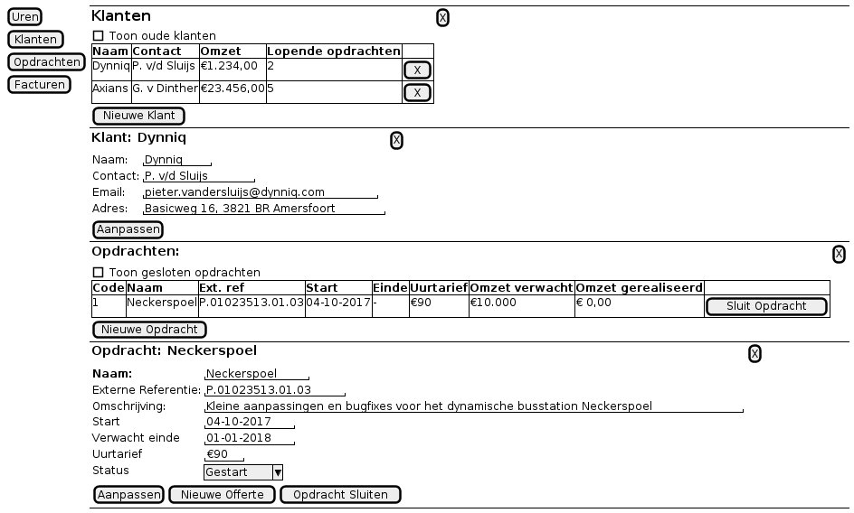
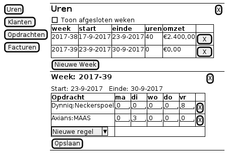

=============
Admingen
=============

-----------------------------------------------
Het genereren van administratieve programma’s
-----------------------------------------------

Overzicht
================

Doel van de administratie generator is een omgeving te creëeren waarin het
zeer eenvoudig is om adminstratieve software te maken die goed samenwerkt met de
standaard pakketten voor het MKB.

Huidige situatie
-------------------

Het schrijven van custom administratieve software is nu een complexe
en tijdrovende zaak, doordat alle acties, verbanden en bewerkingen in een
programmeertaal moeten worden uitgewerkt. Het detail niveau waarop dit gebeurt
is zeer ver verwijderd van de leefwereld van de gebruikers van de software,
zodat specialisten nodig zijn om de vertaling van wensen naar software te maken.

In het verleden is vaak gebruik gemaakt van zogenaamde 4G talen. Deze talen waren
qua abstractieniveau veel dichter bij de gebruikers, maar gebruikten nog steeds
een programmeertaal. Ze zijn uit de mode geraakt omdat de afstand tussen gebruikers
en programmeurs is gegroeid, en de 4G talen niet zijn meegegroeid in de software
ontwikkel technieken.

Ook waren de 4G talen hard gekoppeld met 1 leverancier. Er zijn geen Open-Source
4G talen. Dit maakt het risico op vendor-lockin zeer groot. Ook wordt niet
samengewerkt met de huidige (open) standaarden voor bijvoorbeeld documenten.

4G talen zijn voor het grootste deel imperatief. Dit betekent dat iedere actie
moet worden uitgeprogrammeerd, en dat het lastig is om zaken generiek op te
lossen.

Achter de 4G talen zitten de zeer grote bedrijven, (SAP, Oracle, IBM etc)
die niet direct er op zijn gericht om zo veel mogelijk meerwaarde te creëeren
voor hun klanten. Ook zijn
ze niet gericht op het gebruik van moderne technologie, eerder op het zo veel
mogelijk uitmelken van hun bestaande technieken...

Oplossing
------------

De oplossing is om de stap te maken in abstractie niveau: hergebruiken van standaard
functionaliteit door deze te configureren, en het eenvoudig maken om nieuwe componenten
te maken.

Daarnaast moet makkelijk worden samengewerkt met de rest van de wereld. Er zijn
veel uitstekende tools, zoals Exact Online en Office 365, die door de meeste bedrijven
worden gebruikt. Het wiel moet niet opnieuw worden uitgevonden...

Technieken
----------------

Widgets
================

Views
================

Queries
================

Case Studies
================

Urenadministratie
--------------------

